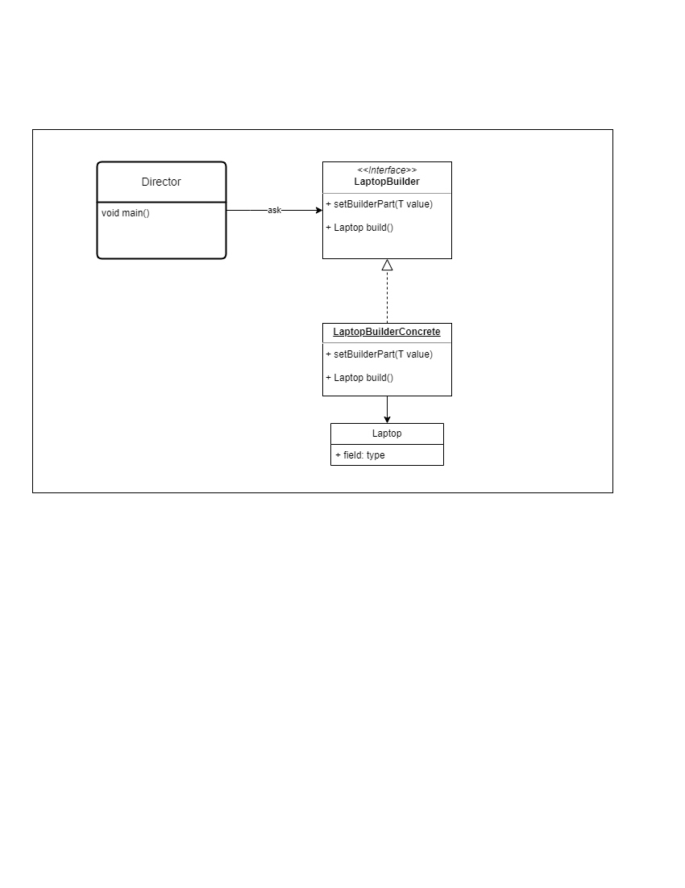

# THE BUILDER PATTERN

## 1. The problem
You are establishing an outlet store specializing in laptops and smartphones.
Initially, your approach involved presenting the devices along with their pricing to customers. 
In order to showcase technology information and warranty details, you opted to create a class named **Laptop**.
However, you encountered challenges with excessive data in the constructor, leading to confusion when attempting to create a new laptop instance.

To address this issue, you decided to refactor the code and implemented the builder design pattern. 
This design choice involves separating partial properties to streamline the creation process and facilitate the input of information. 
This not only enhances the clarity of the code but also ensures a more straightforward and organized method for constructing laptop instances.

## 2. UML

