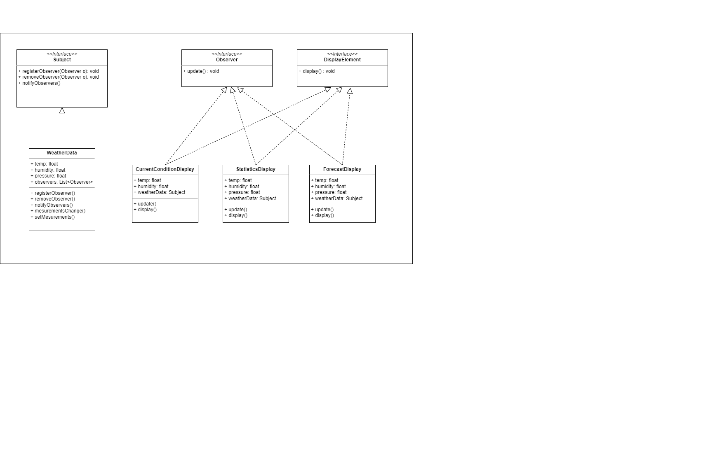

# 02 - THE OBSERVER PATTERN
*Following chapter 02 - Head First Design Pattern*

## 1. The Problem

Your team has been chosen to develop a Weather Monitoring application for Weather-O-Rama, Inc.

Initially, your team is provided with a WeatherData object, which communicates with a physical weather station 
to monitor current weather conditions, including temperature, humidity, and pressure. 

According to the current contract,
your team is tasked with constructing three display components to showcase weather conditions: `CurrentConditionsDisplay`,
`StatisticsDisplay`, and `ForecastDisplay`.

However, in the future, Weather-O-Rama may introduce numerous additional display types.

How can your team achieve this goal and ensure a seamless integration of new display types as they become available?

## 2. The Observer Pattern
The Observer Pattern defines a one-to-many dependency between objects so that when one object changes state,
all of its dependents are notified and updated automatically.

The Observer Pattern provides an object design where subjects and observers are loosely coupled:

    1. The only thing the subject know about an observer is that it implements a certain interface (the Observer interface)
    2. We can add new observers at any time. Because the only thing the subject depends on is a list of objects that implement
    the Observer interface, we can add new observers whenever we want.
    3. We never need to modify the subject to add new types of observers. The subject don't care about the concrete of Obsever object
    it will deliver notifications to any object that implements the Observer interface.
    4. We can reuse subjects or observers independently of each other
    5. Change to either the subject or an observer will not affect the other.

## 3. UML
